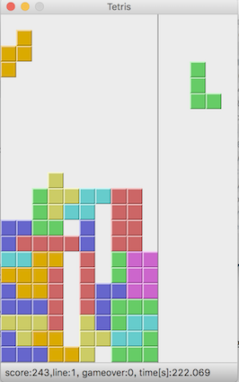
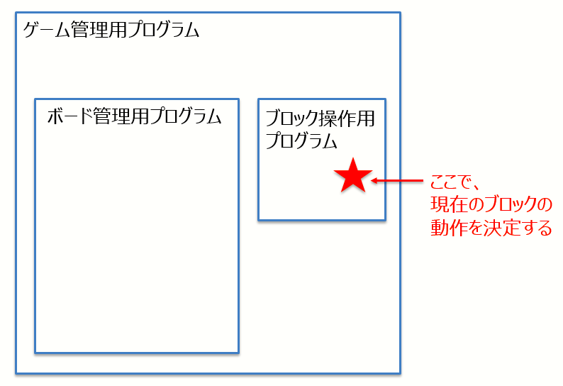

# Tetris Game

プログラミング学習を目的とした、ブロックを操作してスコアを競うゲームです。<br>
[FAQ](https://github.com/seigot/tetris_game/blob/master/doc/files/FAQ.md)はこちら。<br>
[tutorial](https://github.com/seigot/tetris_game_tutorial)はこちら。

## 実行環境準備

#### Mac環境

Finder→Application→Utility→Terminalから、ターミナルを起動して以下コマンドを実行する。

```
# install pyqt5 and NumPy
brew install python3
pip3 install pyqt5
pip3 install numpy
# install other packages
brew install git
```

[doc/files/install_mac.md](./doc/files/install_mac.md)に上記手順を記載

#### Ubuntu/JetsonNano環境

[doc/files/install_ubuntu.md](./doc/files/install_ubuntu.md)に手順を記載

#### windows環境

[WSL(Windows Subsystem for Linux)を使う場合](./doc/files/install_windows_wsl.md)の手順<br>
[Docker for Windowsを使う場合](./doc/files/install_windows.md)の手順<br>

#### docker環境

[docker/README.md](docker/README.md)に手順を記載

## 実行方法

本リポジトリを取得

```shell
cd $HOME
git clone https://github.com/seigot/tetris_game
```

ゲーム開始用スクリプトを実行

```shell
cd tetris_game
bash start.sh
```



## ファイル構成

#### ファイル一覧

* `game_manager/game_manager.py` : ゲーム管理用プログラム
* `game_manager/board_manager.py` : ボード管理用プログラム
* `block_controller.py` : ブロック操作用プログラム（ブロックの操作は、このファイルを更新して下さい。）
* `start.sh` : ゲーム開始用スクリプト

#### 詳細

以下のような構成になっています。<br>
ブロック操作用プログラムは、管理プログラムから定期的に呼び出されるので、ボード情報から次の動作を決定して下さい。 <br>



詳細
- [ブロック操作用プログラムについての説明](doc/files/block_controller.md) <br>
- [ボード管理用プログラムについての説明](doc/files/board_manager.md)（執筆中） <br>
- [ゲーム管理用プログラムについての説明](doc/files/game_manager.md)（執筆中） <br>

## 手動操作

実行時、以下のようにオプションを与えることで、手動操作が可能です。
操作方法は、PC操作準拠とゲーム機コントローラ準拠の2種類を選択できるようにしています。

### PC操作準拠

```shell
bash start.sh -m y
```

|  操作キー  |  動作  |
| ---- | ---- |
|  *up* key  |  回転  |
|  *left* key  |  左に移動  |
|  *right* key   |  右に移動  |
|  *m* key  |  下に移動  |
|  *space* key  |  落下  |
|  *P* key  |  Pause  |

### ゲーム機コントローラ準拠

```shell
bash start.sh -m g
```

|  操作キー  |  動作  |
| ---- | ---- |
|  *space* key  |  回転  |
|  *left* key  |  左に移動  |
|  *right* key   |  右に移動  |
|  *m* key  |  下に移動  |
|  *up* key  |  落下  |
|  *P* key  |  Pause  |

## スコアアタック用サンプルコード

実行時、以下のようにオプションを与えることで、スコアアタック用サンプルコードの実行が可能です。<br>
サンプルコードについて[ブロック操作用サンプルプログラム](https://github.com/seigot/tetris_game/blob/master/doc/files/block_controller_sample.md)を参照下さい。<br>

```shell
bash start.sh -s y
```

# Play rules

制限時間内の獲得スコアを評価します。

## Score

加点

|  項目  |  得点  |  備考  |
| ---- | ---- |  ---- |
|  1ライン消し  |  + 100点  |  -  |
|  2ライン消し  |  + 300点  |  -  |
|  3ライン消し  |  + 700点  |  -  |
|  4ライン消し  |  + 1300点  |  -  |
|  落下ボーナス  |  + 落下したブロック数を得点に加算  |  -  |

減点

|  項目  |  得点  |  備考  |
| ---- | ---- |  ---- |
|  gameover  |  - 500点  | ブロック出現時にフィールドが埋まっていたらgameover

## game level

実行時、オプションを与えることで、難易度（レベル）を指定できます。<br>

|     |  level1  |  level2  |  level3  | 
| --- | --- | --- | --- | 
|  実行方法  | bash start.sh | bash start.sh -l2  | bash start.sh -l3 | 
|  制限時間  |  180秒  |  180秒  |  180秒  | 
|  ブロックの順番  |  固定(1-7まで順番に繰り返し)  |  ランダム  |  ランダム  | 
|  フィールドの初期ブロック  |  なし  |  なし  |  あり  | 
|  フレーム更新頻度  |  約1秒  |  約1秒  |  約1秒  | 
|  備考  |  今回のスコアアタック用  |  -  |  -  | 

[各レベルの参考スコア](doc/files/reference_score.md)

# コード作成のはじめかた

### 本リポジトリのfork

まず、Githubアカウントを取得して本リポジトリを自リポジトリにforkして下さい。

> リポジトリのフォークの例 <br>
> 
> 0. GitHubアカウントを作成/ログインする。 <br>
> 1. GitHub で、[https://github.com/seigot/tetris_game](https://github.com/seigot/tetris_game)リポジトリに移動します <br>
> 2. ページの右上にある [Fork] をクリックします。 <br>
> 参考：[リポジトリをフォークする](https://docs.github.com/ja/free-pro-team@latest/github/getting-started-with-github/fork-a-repo) <br>

その後、自リポジトリにforkした`tetris_game`をローカルマシンに取得して下さい。

```
cd ~
git clone https://github.com/<yourname>/tetris_game   # "<yourname>"さん（yourname=自分のアカウント名に読みかえて下さい）のリポジトリを取得する場合
git clone https://github.com/seigot/tetris_game       # このリポジトリを取得する場合
```

既に`tetris_game`が存在しており、これを削除したい場合は`rm -f`を実行して下さい。

```
sudo rm -rf tetris_game
```

取得後はソースコード変更、変更リポジトリに反映する等してアップデートを進めて下さい。

### 実行

`実行方法`を参考に実行環境の構築をして下さい。<br>
環境構築の完了後、ブロック操作用プログラム[`block_controller.py`](https://github.com/seigot/tetris_game/blob/master/block_controller.py)を更新していってください。<br>

### 自リポジトリのバイナリを公式リリースする

提出時、自リポジトリのバイナリを公式リリースする場合は、Githubリリースの機能を使うと簡単なのでお勧めです。

> 自リポジトリのコードを提出（バイナリリリース）する場合の手順参考 <br>
> [リポジトリのリリースを管理する](https://docs.github.com/ja/free-pro-team@latest/github/administering-a-repository/managing-releases-in-a-repository) <br>
> 7.オプションで、コンパイルされたプログラムなどのバイナリファイルをリリースに含めるには、ドラッグアンドドロップするかバイナリボックスで手動で選択します。 <br>

### 本リポジトリの最新バージョン取り込み

今後、本リポジトリもバージョンアップしていく予定です。<br>
本リポジトリのバージョンアップを取り込む場合は、forkしたリポジトリにて以下を実行して下さい。<br>

※追記 2021/5より、Github UI上から操作可能になったようです。<br>
[GitHub新機能「Fetch upstream」使ってみた！　1クリックで親リポジトリに追従（同期）](https://note.com/llminatoll/n/n423296287697)<br>

```
git checkout master                                        # ローカルのmainブランチに移動
git remote add upstream https://github.com/seigot/tetris_game  # fork元のリポジトリをupstream という名前でリモートリポジトリに登録（名前はなんでもいい。登録済みならスキップ）
git fetch upstream                                         # upstream から最新のコードをfetch
git merge upstream/master                                  # upstream/main を ローカルのmaster にmerge
git push                                                   # 変更を反映
```

参考：[github で fork したリポジトリで本家に追従する](https://please-sleep.cou929.nu/track-original-at-forked-repo.html)

### Pull Requestを送る（Optional）

本リポジトリへ修正リクエストを送ることが可能です。詳しくは参考をご参照下さい。<br>
<br>
※追記　Pull Request練習用リポジトリを作成しました。<br>
[test_pull_request](https://github.com/seigot/test_pull_request)<br>
<br>
参考：<br>
[GitHub-プルリクエストの作成方法](https://docs.github.com/ja/free-pro-team@latest/github/collaborating-with-issues-and-pull-requests/creating-a-pull-request)<br>
[[実践] はじめてのPull Requestをやってみよう](https://qiita.com/wataryooou/items/8dce6b6d5f54ab2cef04)<br>
[【GitHub】Pull Requestの手順](https://qiita.com/aipacommander/items/d61d21988a36a4d0e58b)<br>

### FAQ

[doc/files/FAQ.md](doc/files/FAQ.md)を参照下さい。

# 参考

[https://github.com/LoveDaisy/tetris_game](https://github.com/LoveDaisy/tetris_game) <br>
[http://zetcode.com/gui/pyqt5/tetris/](http://zetcode.com/gui/pyqt5/tetris/)<br>
[テトリスの歴史を「ブロックが落ちるルール」の進化から学ぶ](https://gigazine.net/news/20191116-tetris-algorithm/)<br>

# 今後の課題

## 次のブロックのランダム性

次のブロックのランダム性は、現在はrandom関数の出力に依存しています。<br>
しかし、[こちらの記事](https://gigazine.net/news/20191116-tetris-algorithm/)によると選択方式が色々ありそうです。<br>
有識者の方からアドバイス頂けると助かります。<br>

* 参考：次のブロック選択処理 [game_manager.py](game_manager/game_manager.py)

```
nextShapeIndex = np_randomShape.random.randint(1, 7)
```

## 対戦モード実装
準備中

## AI実装
準備中

## 自動評価
準備中

# LICENSE

[MIT LICENSE](LICENSE)

# Finnaly

~ HAVE FUN ~
