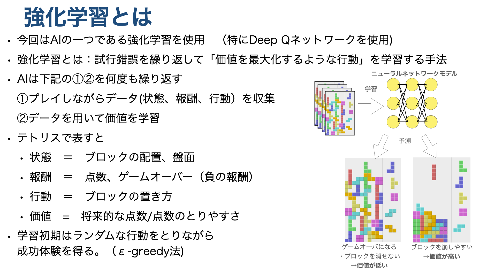

# AIについて（準備中）

# 1.環境準備
- sample のコードでは [pytorch](https://pytorch.org/get-started/locally/) を使ってAIのニューラルネットワークを構築します。  
- pytorch　については[こちら](https://pytorch.org/get-started/locally/)を参考にし、環境に合わせてインストールしてください。

### 例) WindowsのCPU動作用をインストールする場合
```
pip3 install torch torchvision torchaudio
```
### 例) MacのCPU実行用をインストールする場合
```
pip3 install torch torchvision torchaudio
```

# 2.学習と推論

* サンプルとして下記の２つのニューラルネットワークが 
[こちら](../../game_manager/machine_learning/model/deepqnet.py)
のコードに定義されています。

    * sample: DQN(Deep Q Network)を使った学習・推論
    * sample2: MLP (Multilayer perceptron)を使った学習・推論


## 2.1学習の実行
- DQN(Deep Q Network)を使う場合

```
python start.py -m train_sample -d 1 -l 2 -t -1
```

-  MLP (Multilayer perceptron)を使う場合
```
python start.py -m train_sample2 -d 1 -l 2 -t -1
```

## 2.2推論の実行

- DQN(Deep Q Network)を使う場合
```
python start.py -m predict_sample -l 2 --predict_weight weight/DQN/sample_weight.pt
```

-  MLP (Multilayer perceptron)を使う場合
```
python start.py -m predict_sample2 -l 2 --predict_weight weight/MLP/sample_weight.pt
```

## 2.3 再学習/追加学習（Fine Tuning) の実行
- 学習済みの重みを初期状態として学習する場合は下記の手順で　configのyamlファイルを設定する。
1. ft_weight に学習済み重みファイルのパスを設定
2. finetune を　False → True に変更
3. initial_epsilon を小さくする（0より大きい１以下の値）

- initial_epsilon は ε-greedy法というアルゴリズムのパラメータになり、学習初期ににどの程度ランダムな行動を取るかを設定します。追加学習の場合は、小さい値を設定することで、学習済みのモデルを有効活用できます。
- ε-greedy法については下記のサイトなどが参考になります。
    - [https://horomary.hatenablog.com/entry/2021/01/26/233351](https://horomary.hatenablog.com/entry/2021/01/26/233351)

## 2.4 -m オプションについて
 - 学習/推論の切り替えおよびサンプル/本番コードの切り替には　"-m"　オプションを使用します。

**※ sampleコードは基本的に変更せず、[本番用コード](../../game_manager/machine_learning/block_controller_train.py )で開発してください**

- "-m" オプションに対して下記の引数を渡すことで書くモードを切り替えられる。

|オプション名|説明|
| ---- | ---- |
| train_sample| [サンプルコード1](../../game_manager/machine_learning/block_controller_train_sample.py)を用いてDQNによる学習を行う|
| train_sample2| [サンプルコード2](../../game_manager/machine_learning/block_controller_train_sample2.py)を用いてMLPによる学習を行う|
| train| [本番用コード](../../game_manager/machine_learning/block_controller_train.py ) を用いて学習を行う|
| predict_sample| [サンプルコード1](../../game_manager/machine_learning/block_controller_train_sample.py)を用いてDQNによる推論を行う。<br> 実行時に--predict_weight オプションにより重みのパスを選択する必要があります。|
| predict_sample2| [サンプルコード2](../../game_manager/machine_learning/block_controller_train_sample2.py)を用いてMLPによる学習を行う　<br> 実行時に--predict_weight オプションにより重みのパスを選択する必要があります。|
| predict| [本番用コード](../../game_manager/machine_learning/block_controller_train.py ) を用いて学習を行う　<br> 実行時に--predict_weight オプションにより重みのパスを選択する必要があります。|


## 2.5 AI関連のその他オプションについて
- AI学習関連のオプションは下記

|オプション名|引数|説明| train or predict|
| ---- | ---- | ---- | ---- |
| *--train_yaml* | 学習に用いるyamlファイルのパス|学習に用いるyamlファイルを選択する。|train|
| *--predict_weight* | 推論に用いるweightファイルのパス|推論に用いるweightファイルを選択する|predict|


# 3. 強化学習について
[サンプルコード1](../../game_manager/machine_learning/block_controller_train_sample.py)  　および　[サンプルコード2](../../game_manager/machine_learning/block_controller_train_sample2.py) では強化学習と呼ばれる方法でテトリスをプレイするための最適なパラメータを学習します。 




# 4. パラメータについて
## 4.1 yamlファイルについて
- サンプルコードではyaml ファイルによってハイパーパラメータ（パラメータを学習するためのパラメータ）を設定する。
- サンプル用yaml ファイルのフォーマットは下記

<details><summary>共通</summary>

|パラメータ名|説明|型|train or predict|default|
| ---- | ---- | ---- | ---- | ---- |
|**common** |- |- |- |-|
|ft_weight|ファインチューニング(初期値として学習済み<br>の重みを用いる学習)に用いる重みファイルのパス|str|train|None|
|log_path| tensorboardのログ出力フォルダ名|str|共通|tensorboard|
</details>

<details><summary>model関連</summary>

|パラメータ名|説明|型|train or predict|default|
| ---- | ---- | ---- | ---- | ---- |
|**model** |- |- |- |-|
|name|使用するAIモデル名|str|共通|DQN|
|finetune|ファインチューニングするかどうかのフラグ|bool|train|False|
|**state** |- |- |- |-|
|dim|状態の次元数|int|共通|4|
</details>

<details><summary>学習</summary>

|パラメータ名|説明|型|train or predict|default|
| ---- | ---- | ---- | ---- | ---- |
|**train** |- |- |- |-|
|optimizer|最適化関数(サンプルではAdamまたはSGDが使用可能)|str|train|Adam|
|lr|学習率|float|train|1.0e-3|
|lr_gamma|更新率(optimizerがSGDの時のみ使用)|float|train|0.1|
|lr_momentum|モーメンタム(optimizerがSGDの時のみ使用)|float|train|0.99|
|lr_step_size|ステップサイズ(optimizerがSGDの時のみ使用)|int|train|1000|
|num_epoch|エポック数(学習するイテレーション数)|int|train|5000|
|num_decay_epochs|ε-greedyのεを最小にするエポック数<br>(ここからランダム性を下げる。)|int|train|3000|
|initial_epsilon|ε-greedyのεの初期値|float|train|1.0|
|final_epsilon|ε-greedyのεの最小値|float|train|1.0e-3|
|batch_size|バッチサイズ|int|train|512|
|gamma|割引率|float|train|0.99|
|max_penalty|ペナルティの最大値|float|train|-1|
|target_net|TargetNetworkの使用フラグ|bool|train|True|
|target_copy_intarval|TargetNetworkにコピーするインターバル|int|train|500|
|replay_memory_size|Experience replayのreplay bufferのサイズ|int|train|30000|
|double_dqn|Double DQNの使用フラグ|bool|train|True|
|reward_clipping|Reward clippingの使用フラグ|bool|train|True|
|prioritized_replay|Prioritized Experience Replayの使用フラグ|bool|train|True|
|multi_step_learning|Multi step learningの使用フラグ|bool|train|True|
|multi_step_num|Multi step learningのステップ数|int|train|0,100,300,700,1300,-1300 <br>　左から　0列崩し,1列崩し,2列崩し,3列崩し,4列崩し,ゲームオーバー)|
|reward_list|点数に応じた報酬の設定値<br>（0列崩し,1列崩し,2列崩し,3列崩し,4列崩し,ゲームオーバーの順）|int|train|3|
|reward_weight|点数以外で与えられるペナルティの重み<br>（隣接する行との高さ差分,最大の高さ,穴の数 の順)<br> 0以上の値が必須|float|train|0.01,0.0,0.01 <br>（左から　隣接する行との高さ差分,最大の高さ,穴の数 ）|
</details>

## 4.2 パラメータ調整例（得たい効果とパラメータの関係例）
- 下記にパラメータ調整の方針例を記載する
- それぞれの効果が常に得られるとは限らないので実験を繰り返しながら、最適な値を探してみてください。
1. ブロックを積み上げる
    - reward_listの３列崩し、４列崩しの値を大きくする
    - reward_weightの max_heightを小さくする

2. ゲームオーバの発生を防ぐ（ブロックを積み上げ量を減らす）
    - reward_listの３列崩し、４列崩しの値を小さくする
    - reward_weightの max_heightを大きくする

3. 過去の盤面からの影響を小さくする
    - gamma(割引率)を大きくする。

4. 学習を安定させる
    - reward_clipping を Trueにする。
    - target_net を Trueにする
    - double_DQN を Trueにする。

5. 学習を早くする。（学習するモデルのパラメータを減らす）
    - モデルのレイヤ数、カーネルサイズを減らす
    - MLPを使用する

6. 学習を早くする。（効果の高いデータを効率的に学習に使用する）
    - prioritized_replay を Trueにする。
    - lr（学習率）を大きくする。（大きすぎると収束しなくなるので注意）
    - batch_size　を大きくする （学習に使用するメモリ量が大きくなるので注意）
    - replay_memory_size　（学習に使用するメモリ量が大きくなるので注意）


# 5.チュートリアルの実行
- サンプル用のコードを試すための[チュートリアル用Jupyter-notebook]()../../game_manager/machine_learning/)
を用意しているので、コード理解のためにお使いください。

- Jupyter-notebookか下記の手順で使用できます.
- 1. Jupyter-notebookのインストール
```
pip install jupyter
```

- 2. Jupyter-notebookの起動
```
jupyter notebook
```
下記のような画面が、ブラウザで開かれるので
game_manager > machine_learning > model > tutorial 
の準備進み、***.ipynb ファイルを開いてください。


- Jupyter-notebook のセルは　Shit＋Enter key で実行できます

- Jupyter-notebook の使い方は下記のサイトなどが参考になります。
[https://qiita.com/takuyanin/items/8bf396e7b6b051670147](https://qiita.com/takuyanin/items/8bf396e7b6b051670147)

- venv などの仮想環境を用いている場合は下記のサイトなどが参考になります。
　　
[https://qiita.com/smiler5617/items/e0d9b3034d79457cc253](https://qiita.com/smiler5617/items/e0d9b3034d79457cc253)

# 6. さらなる強化に向けて
- 第3回での cookie4869 の強化資料を下記で共有いたします。


