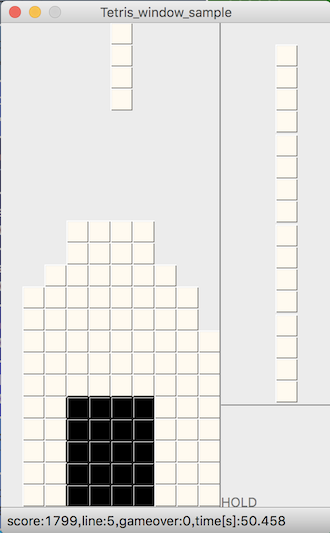
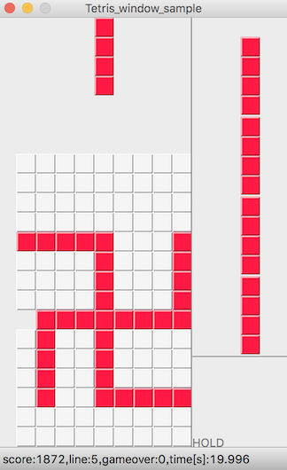
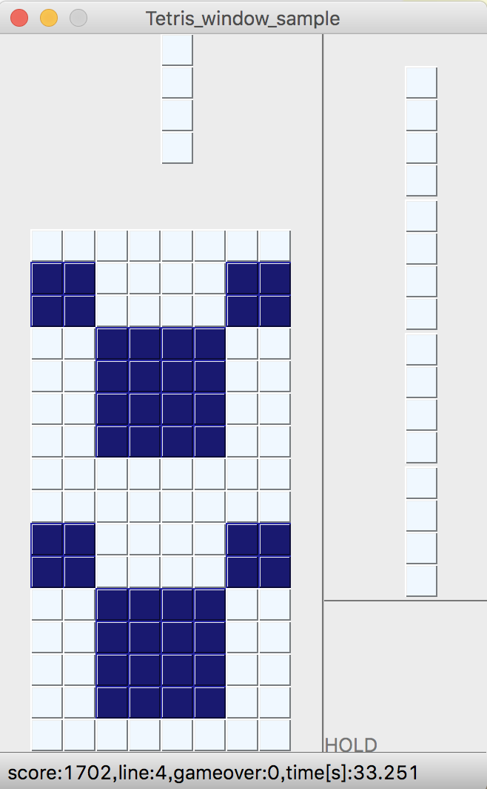

# artについて

本ドキュメントではテトリスアートの取り組みについて記載する

# 概要

通常、テトリスは上から落ちてくるブロック（テトリミノ）を操作して、横列を埋めて消していくようにして遊ぶ。  
一方、テトリスアートはブロックでフィールドに模様を描くことを目的とする。（ブロックを消すことを必ずしも目的としない）  
詳しくは"テトリスアート"でgoogle検索をしてみて下さい。  

# 取り組み方

1.まず、ブロックでフィールドに描きたい模様をイメージする。  
2.次に、模様がテトリス上で実現可能かどうかを検討する。（作図などがお勧めです）  
3.実現可能であればブロックを操作して模様を作成する。
  
3.によりブロックを操作する場合、後述するconfigファイルを使い各ブロックの色や出現順序(index)などを調整できるようにしている。  

# サンプルコード

`python start.py`実行時に以下オプションを指定するとサンプルコードが実行される  
[youtube-link: tetris art sample](https://www.youtube.com/watch?v=Seh6g9_nL6o)  

`1:onigiri`

```
python start.py -l1 -m art --art_config_filepath config/art/art_config_sample1.json
```



`2:manji`

```
python start.py -l1 -m art --art_config_filepath config/art/art_config_sample2.json
```



`3:cartoon charactor`

```
python start.py -l1 -m art --art_config_filepath config/art/art_config_sample3.json
```



other sample 

|  name  |  --art_config_filepath  |  note  |
| ---- | ---- | ---- |
|  4:heart  |  python start.py -l1 -m art  --art_config_filepath config/art/art_config_sample4.json  |  -  |
|  5:hamburger_shop  |  python start.py -l1 -m art  --art_config_filepath config/art/art_config_sample5.json  |  -  |
|  6:parking  |  python start.py -l1 -m art  --art_config_filepath config/art/art_config_sample6.json  |  -  |
|  7:team rocket  |  python start.py -l1 -m art  --art_config_filepath config/art/art_config_sample7.json  |  -  |
|  8:happy_new_year_2023  |  python start.py -l1 -m art  --art_config_filepath config/art/art_config_sample8.json  |  -  |
|  9:taka  |  python start.py -l1 -m art  --art_config_filepath config/art/art_config_sample9.json  |  -  |
|  ...  |  -  |  -  |

contribution

|  name  |  --art_config_filepath  |  thanks  |
| ---- | ---- | ---- |
|  mario  |  python start.py -l1 -m art  --art_config_filepath config/art/art_config_sample_tanaka_2.json  |  @tanaken  |
|  ...  |  -  |  -  |

# configファイルの説明

テトリスアートを作成し易くするために各ブロックの色や出現順序(index)などをconfigファイルで調整できるようにしている。  
以下はconfigファイルの説明である。  

art用configファイルサンプル  
[config/art/art_config_sample_default.json](https://github.com/seigot/tetris/blob/master/config/art/art_config_sample_default.json)  

```
{
  // 各ブロックの色を調整する。色についてはカラーコードを参照下さい。
  "color": {
    "shapeI": "0xCC6666",
    "shapeL": "0x66CC66",
    "shapeJ": "0x6666CC",
    "shapeT": "0xCCCC66",
    "shapeO": "0xCC66CC",
    "shapeS": "0x66CCCC",
    "shapeZ": "0xDAAA00"
  },
  // 各ブロックの出現順序(index)/direction/x/yを調整する。
  // 行を追加することが可能であり、追加すると記載に応じたブロックが出現する。
  "block_order": [ 
      [1,0,0,1],
      [2,0,0,1],
      [3,0,0,1],
      [4,0,0,1],
      [5,0,0,1],
      [6,0,0,1],
      [7,0,0,1]
  ]
}
```

ブロックの色については以下のカラーコードを参考にしてください。  

> [色の名前とカラーコードが一目でわかるWEB色見本 原色大辞典 - HTMLカラーコード](https://www.colordic.org/)  

各ブロックの出現順序(index)/direction/x/yについては以下を参考にしてください。  

> [ブロック操作用プログラムについて](./block_controller.md)  

# 実行方法

以下のように`-m art`,`--art_config_filepath`によりモード及びconfigファイルを指定する。

```
# "art_config_sample.json"を指定して実行
python start.py -l1 -m art --art_config_filepath config/art/art_config_sample.json

# 落下速度を早くする場合は"-d500"を加えて実行
python start.py -l1 -m art --art_config_filepath config/art/art_config_sample.json -d500
```

自作したart用configファイル(`xxx.json`)を作成する場合は以下のようにファイルコピーして使用してください。  

```
# 事前にサンプルをコピーしておく(art_config_sample.json --> xxx.json)
cp config/art/art_config_sample.json config/art/xxx.json
# 実行
python start.py -l1 -m art --art_config_filepath config/art/xxx.json
```

# 参考
[「テトリス」の斬新すぎる遊び方が話題に。積み上げたブロックでマリオやルイージを再現!?](https://nlab.itmedia.co.jp/nl/articles/1109/13/news025.html)  
[色の名前とカラーコードが一目でわかるWEB色見本 原色大辞典 - HTMLカラーコード](https://www.colordic.org/)  
[youtube-link: tetris art sample](https://www.youtube.com/watch?v=Seh6g9_nL6o)  
