>本ページでは、[ブロック操作用プログラム](https://github.com/seigot/tetris_game/blob/master/block_controller.py)について説明を追記頂ける方を募集しています。<br>
>説明の追記方法は、[`Pull Requestを送る`](https://github.com/seigot/tetris_game#pull-requestを送るoptional)を参照下さい。<br>

# ブロック操作用プログラムについて

[ブロック操作用プログラム](https://github.com/seigot/tetris_game/blob/master/block_controller.py)では、ボード情報からブロックの次の動作を決定します。<br>
このファイルの`def GetNextMove`関数にて、ボード情報`GameStatus`を入力として受け取り、次の動作決定用のデータ`nextMove`を返す事でブロックが動く仕様になっています。<br>
<br>
以下は、ボード情報`GameStatus`、次の動作決定用のデータ`nextMove`について記載します。<br>

# ボード情報
ボード情報には以下が含まれます。<br>
詳細は、[`GameStatus`データ構造](https://github.com/seigot/tetris_game/blob/master/doc/files/GameStatus.md)や、[サンプルコード](https://github.com/seigot/tetris_game/blob/master/game_manager/board_controller_sample.py)のようにGameStatusをログ出力することで確認可能です。

```
* field_info : フィールド情報
* block_info : ブロック情報
* judge_info : 審判情報
* debug_info : デバッグ情報
```

# フィールド情報

## フィールドの定義
フィールドは横幅10×高さ22ブロック分の大きさです。<br>
座標系は、左上を原点(0,0)として、x軸は右側、y軸は下側を正の方向として定義しています。<br>

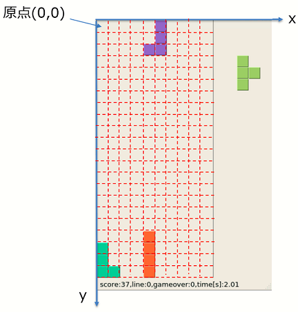

フィールドのデータは、一次元配列として定義しています。<br>
座標(x, y)のデータは、一次元配列の[x + y * 横幅]番目にアクセスすることで取得可能です。<br>
<br>
|     |  フィールド  |  一次元配列  |
| --- | --- | --- |
| データ | 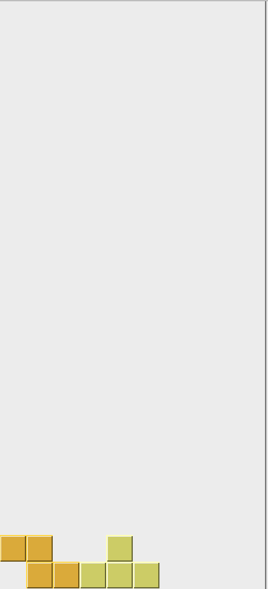 | 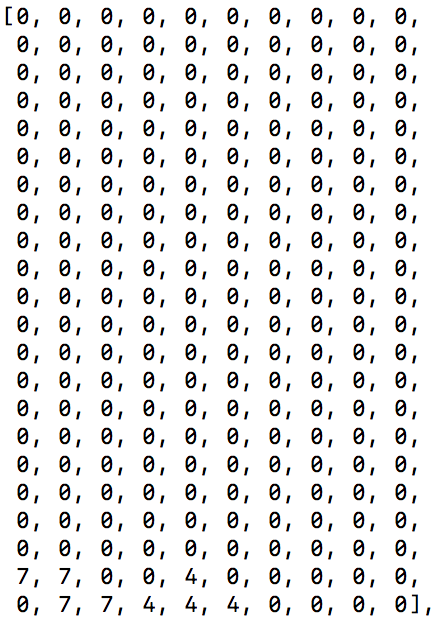 |

## フィールド情報に格納されているデータ

上記の一次元配列の各座標にブロックが有るか無いかを管理しています。

```
* `0以外` : ブロック有り
* `0` : ブロック無し
```

ブロックが有る場合は、各ブロックのIndex値を格納しています。<br>
Index値はブロック情報を参照下さい。

# ブロック情報

## ブロックの定義
ブロックは７種類あり、Index値と初期形状を以下の通り定義しています。<br>
横移動と回転が可能です。<br>
回転は反時計回りに回転します。ブロックによって１周の回転に必要な回数が異なります。<br>

|     |  ShapeI  |  ShapeL  |  ShapeJ  |  ShapeT  |  ShapeO  |  ShapeS  |  ShapeZ  |
| --- | --- | --- | --- | --- | --- | --- | --- | 
| index値 | 1 | 2 | 3 | 4 | 5 | 6 | 7 | 
| 初期形状 |  | 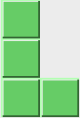 | 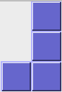 | 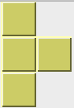 | 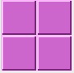 | 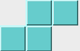 | 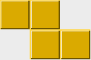 | 
| １周の回転に必要な回数 | 2 | 4 | 4 | 4 | 1 | 2 | 2 | 

## ブロック操作の基準点
各ブロックには操作の基準となる点（以下、ブロック操作の基準点）があります。<br>
また、ブロック操作の基準点以外の座標も取得可能です。基準点(x,y)とその周囲の座標は以下のように表します。<br>

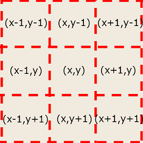

ブロック毎に操作の基準点(x,y)は異なります。各ブロックの形状毎の基準点とそれ以外の座標は以下の通り。<br>

|     |  ShapeI  |  ShapeL  |  ShapeJ  |  ShapeT  |  ShapeO  |  ShapeS  |  ShapeZ  |
| --- | --- | --- | --- | --- | --- | --- | --- | 
| 形状0における操作の基準点(x,y) |  | 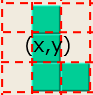 | 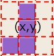 | 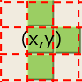 | 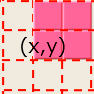 | 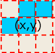 | 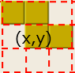 | 
| 基準点とそれ以外の座標 | (x,y-1),(x,y),(x,y+1),(x,y+2) | (x,y-1),(x,y),(x,y+1),(x+1,y+1) | (x,y-1),(x,y),(x,y+1),(x-1,y+1) | (x,y-1),(x,y),(x+1,y),(x,y+1) | (x,y-1),(x+1,y-1),(x,y),(x+1,y) | (x,y-1),(x+1,y-1),(x-1,y),(x,y) | (x-1,y-1),(x,y-1),(x,y),(x+1,y) | 
| 形状1における操作の基準点(x,y) |   | 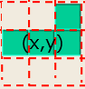 | 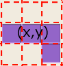 | 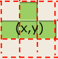 | --- | 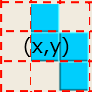 | 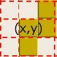 | 
| 基準点とそれ以外の座標 | (x-2,y),(x-1,y),(x,y),(x+1,y) | (x+1,y-1),(x-1,y),(x,y),(x+1,y) | (x-1,y),(x,y),(x+1,y),(x+1,y+1) | (x,y-1),(x-1,y),(x,y),(x+1,y) | --- | (x,y-1),(x,y),(x+1,y),(x+1,y+1) | (x+1,y-1),(x,y),(x+1,y),(x,y+1) | 
| 形状2における操作の基準点(x,y) | --- | 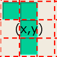 |  | 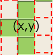 | --- | --- | --- | 
| 基準点とそれ以外の座標 | --- | (x-1,y-1),(x,y-1),(x,y),(x,y+1) | (x,y-1),(x+1,y-1),(x,y),(x,y+1) | (x,y-1),(x-1,y),(x,y),(x,y+1) | --- | --- | --- | 
| 形状3における操作の基準点(x,y) | --- | 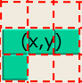 | 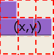 | 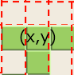 | --- | --- | --- |
| 基準点とそれ以外の座標 | --- | (x-1,y),(x,y),(x+1,y),(x-1,y+1) | (x-1,y-1),(x-1,y),(x,y),(x+1,y) | (x,y+1),(x-1,y),(x,y),(x+1,y) | --- | --- | --- | 

尚、基準点とそれ以外の座標については現在のブロック情報（メソッド`Shape_class.getCoords()`）から取得可能です。<br>
また、各形状におけるx,y方向の最大長は、現在のブロック情報（メソッド`Shape_class.getBoundingOffsets()`)から取得可能です。<br>
取得の具体的な実装方法は、[ブロック操作用サンプルプログラム](https://github.com/seigot/tetris_game/blob/master/doc/files/block_controller_sample.md)を参照ください。

## ブロック出現時の初期位置
ブロックは、ブロック操作の基準点が座標(5,1)になるように出現します。

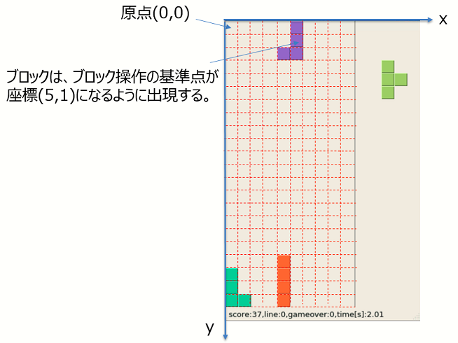

尚、ブロックの出現時、既に基準点(x, y)にブロックが存在していると`game over`となりフィールドがリセットされます。

## ブロック情報に格納されているデータ

主に以下を格納しています。

* `現在のブロック操作の基準点(x,y)`
* `現在のブロックのIndex値`
* `次のブロックのIndex値`

# 審判情報

以下を格納しています。

* `経過時間[s]` : ゲーム開始時からの経過時間
* `スコア[点]` : ゲーム開始時から現在までに獲得した合計スコア
* `ライン数` : ゲーム開始時から現在までに消したラインの数
* `ゲームオーバー回数` : ゲーム開始時から現在までにゲームオーバーになった回数

# デバッグ情報

以下等を格納しています。

* `スコア内訳` : 合計スコア（消したライン、落下ボーナス）の内訳

その他、詳細はコード上のGameStatusを参照下さい。

# 次の動作決定用のデータ

以下のデータを、次の動作決定用のデータ`nextMove`に与えることで次の動作を決定します。<br>
`nextMove`は辞書型のデータであり、`nextMove["strategy"]`以下の各値に応じてブロックが動きます。<br>

* `direction` : 現在の形状から時計回りに何回回転するか（範囲：0〜(1周の回転に必要な回数-1) ）
* `x` : x座標のどの位置に移動するか（範囲：0-9、x座標の絶対値を指定する）
* `y_operation` : y座標方向の操作（1:落下、0:移動）
* `y_moveblocknum` : y座標方向に移動する場合、y座標に何ブロック分移動するか（範囲：1-21）

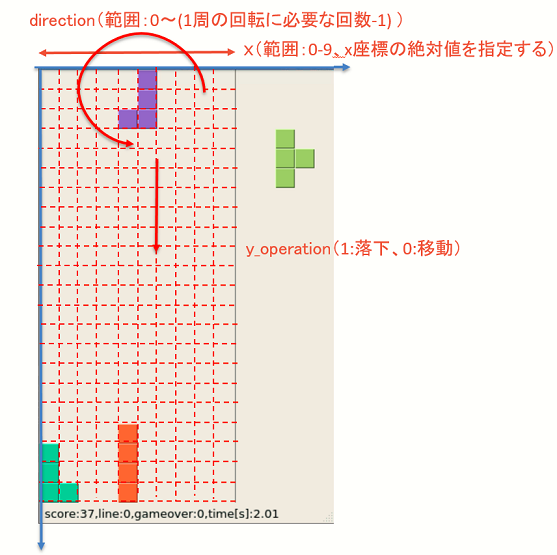
<br>
（今後ルール変更がある場合は、ルールに応じて`nextMove`もアップデートしていく予定です。）

# 使用例
[ブロック操作用サンプルプログラム](https://github.com/seigot/tetris_game/blob/master/doc/files/block_controller_sample.md)を参照ください。
