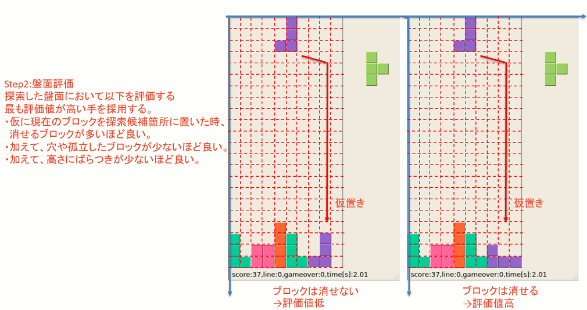

>本ページでは、[ブロック操作用サンプルプログラム(block_controller_sample.py)](https://github.com/seigot/tetris_game/blob/master/game_manager/block_controller_sample.py)について説明を追記頂ける方を募集しています。 
>説明の追記方法は、[`Pull Requestを送る`](https://github.com/seigot/tetris_game#pull-requestを送るoptional)を参照下さい。 

# ブロック操作用サンプルプログラム

一般的に、テトリスは他ゲーム同様に組合せ最適化問題と捉える事が可能であり、過去に様々なアルゴリズムが提案されている。（例えば下記） 
- [ニューラルネットワークと遺伝的アルゴリズムを用いた テトリスコントローラの開発](https://www.google.com/url?sa=t&rct=j&q=&esrc=s&source=web&cd=&ved=2ahUKEwiKn83IqIPxAhWSK5QKHUWVC0cQFjACegQIAxAD&url=https%3A%2F%2Fipsj.ixsq.nii.ac.jp%2Fej%2F%3Faction%3Drepository_action_common_download%26item_id%3D109968%26item_no%3D1%26attribute_id%3D1%26file_no%3D1&usg=AOvVaw0ic6uDC29wGYWl8KKIL8P3)
- [テトリスにおけるAIの開発](https://www.google.com/url?sa=t&rct=j&q=&esrc=s&source=web&cd=&ved=2ahUKEwiKn83IqIPxAhWSK5QKHUWVC0cQFjAEegQIDhAD&url=https%3A%2F%2Fwww.info.kindai.ac.jp%2F~takasi-i%2Fthesis%2F2016_13-1-037-0113_S_Kawahara.ppt&usg=AOvVaw1tik6miknSKem4wE5bmpFP)
- [Tetris is Hard, Even to Approximate](https://arxiv.org/pdf/cs/0210020.pdf)
- ...

本リポジトリはプログラミング練習と共に、探索アルゴリズムの仮説検証にも利用できるようにしている。 
サンプルプログラムでは、一般的な探索アルゴリズムでの基本部分となる、現在ブロックの探索方法、盤面評価を簡潔に実装している。 

## step1.探索方法

[ブロック操作用サンプルプログラム](block_controller_sample.py)の`def GetNextMove(self, nextMove, GameStatus):`関数の、 
`for direction0 in CurrentShapeDirectionRange:`
`for x0 in range(x0Min, x0Max):`部分が該当する。 
ここでは現在のブロックの情報（以下）を使って全探索を行っている。 
- 現在のブロックが回転できる回数 
- 現在のブロックが移動できるx軸方向の移動量 

一般的に、考慮すべき組み合わせが多くなると[ゲーム木](https://ja.wikipedia.org/wiki/ゲーム木)を利用した探索範囲の効率化が行われる。 
今回も１秒（１フレーム更新頻度）以内に次の手を決める必要があり、状況によってはゲーム木の採用が必要と思われる。 
ただ、サンプルコードでは簡潔に理解できることを優先し、現在のブロックを用いた全探索を採用している。 

## step2.盤面評価

[ブロック操作用サンプルプログラム](block_controller_sample.py)の`def GetNextMove(self, nextMove, GameStatus):`関数の、 
` EvalValue = self.calcEvaluationValueSample(board)`部分が該当する。 
 
ここでは以下を考えた盤面評価を行っている。 
- 仮に現在のブロックを探索候補箇所に置いた時、消せるブロックが多いほど良い。 
- 同様に、穴ぼこや孤立したブロックが少ないほど良い。 
- 同様に、高さにばらつきが少ないほど良い。 

しかしサンプルプログラムの方法では盤面に穴が残る事がまだまだ多い。 

# サンプルプログラムの課題

上記の通りサンプルプログラムは最小限の機能しかなく、いくつか課題が存在する。

- 数手先読み探索
  - サンプルプログラムでは探索時に現在のブロックしか考慮できていない。次のブロックや以降を考慮する方が良いはず。
- 盤面評価の改良
  - サンプルプログラムでは目先の１ブロック消す事を優先している。４ブロック消すための手を選択できていない。
  - サンプルプログラムの手法では盤面に穴が残る事がまだまだ多い。
- 最適解を人が考える必要がある。
  - AIのように自ら学習する方が楽に最適解を得られる可能性がある。

上記を解決するとより高いスコアが獲得できると思われる。 
以下の先行文献によるとサンプルプログラムで採用しているパラメータ以外も利用しており、改良の余地がある事は間違いない。 
[ニューラルネットワークと遺伝的アルゴリズムを用いた テトリスコントローラの開発](https://www.google.com/url?sa=t&rct=j&q=&esrc=s&source=web&cd=&ved=2ahUKEwiKn83IqIPxAhWSK5QKHUWVC0cQFjACegQIAxAD&url=https%3A%2F%2Fipsj.ixsq.nii.ac.jp%2Fej%2F%3Faction%3Drepository_action_common_download%26item_id%3D109968%26item_no%3D1%26attribute_id%3D1%26file_no%3D1&usg=AOvVaw0ic6uDC29wGYWl8KKIL8P3)
