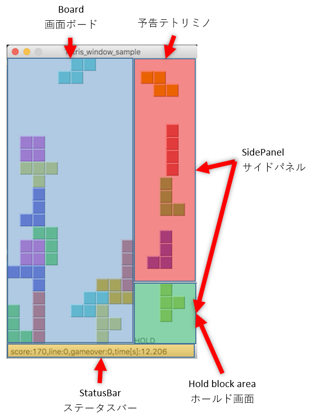

>本ページでは、[ゲーム管理用プログラム](https://github.com/seigot/tetris/blob/master/game_manager/game_manager.py)について説明を追記頂ける方を募集しています。 
>説明の追記方法は、[`Pull Requestを送る`](https://github.com/seigot/tetris#pull-requestを送るoptional)を参照下さい。 

# ゲーム管理用プログラムについて

## [start.py](../../start.py) の Option 設定

ここでは [start.py](../../start.py) で指定する option について解説する。

#### -m --mode モード
    default : ルールベース
    train : AI学習
    predict : AI 推論（予測実行)
    predict_sample : AI MLP 推論（予測実行)
    predict_sample2 : AI DQN 推論（予測実行)
    keyboard : キーボード操作
    gamepad : ゲームパッド操作
#### -l --game_levelレベル
    1 : Level 1 固定テトリミノ
    2 : Level 2 ランダムテトリミノ
    3 : Level 3 初期ブロックありテトリミノ
    4 : Level 4 初期ブロックありテトリミノ 0.001秒更新
#### -d --drop_interval 更新間隔
    default => 1000 (=1秒)
    ms 指定
        ※ テトリミノを DROP すれば この時間待てば次のテトリミノが出るが、降下だけさせた場合は次の操作ができるまでこの時間分停止する。
        ※ Level 4指定した場合は無効
#### -t --game_time ゲーム時間
    default => 180
    秒指定
    -1 で制限なし 学習時は -1 指定推奨。
#### -r --random_seed 乱数のタネ
    整数指定。特別に必要なければ指定しない。
#### -f --resultlogjson
    default => result.json
    結果の json ファイル指定
#### --train_yaml
    default => config/default.yaml
    AI 学習推論時 (train, predict)の設定ファイル指定
#### --predict_weight
    default => outputs/latest/best_weight.pt
    AI 推論時 (predict) の学習結果 weight ファイル指定

## Game_Manager Class

ここでは [game_manager.py](../../game_manager/game_manager.py) の Game_Manager Class を解説する。

### 概要

最初に start.py から呼び出される。このゲームの基本的な動作はこのクラスから各クラス、メソッドを実行することによって行われる。

### 初期化

\_\_init\_\_ にて Option や初期設定値を各インスタンス変数に格納する。
\_\_init\_\_ にある initUI メソッドにて、Window 生成、位置設定表示が行われる。ここで SidePanel Class, Board Class のインスタンスも生成される。
initUI の中の start メソッドで、スコア、画面ボード、予告テトリミノ、ステータスバーがクリアされる。また、この中で timerEvent も生成される。timerEvent の間隔は上記の drop_interval となる。これにより次の操作が可能となる。

### timerEvent method

上記の初期化により timerEvent が drop_interval オプションにて指定された間隔で実行される。
この Event によりゲームが進行していく。
なお、timerEvent メソッド実行中に drop_interval 指定の時間を超えても、次の timerEvent は発生しない。
よって、drop_interval が非常に短い (1ms など = Level 4) の場合は、timerEvent のロスが多発する。
そういったルールの場合はいかに早く timerEvent を終了させるかが肝となる。

timerEvent において各 mode に対応する [block_controller.py](block_controller.md) (or block_controller_train*.py) の GetNextMove が呼び出される。
ここで、[GameStatus](GameStatus.md) が GetNextMove に引き渡され、各自のプログラムで指示した操作結果が nextMove 変数に格納される。

この結果をもって、テトリミノのホールド、横移動、回転、落下、降下処理を行う。

ホールドはホールド画面のテトリミノとの入れ替えを行う。ただし、ホールド画面に何もない場合はホールド画面に現テトリミノを入れて timerEvent を終了する。

横移動は画面ボードの端やテトリミノにぶつかると停止する。

回転は**右回転** (rotateRight)で行い、画面ボードの端やテトリミノにぶつかるとエラーとなりtimerEvent無効となるので要注意である。

降下 (move down) 処理の場合は指定数分降下させる。

落下 (drop down) 処理が行われると、ただちにテトリミノは一番低いところまで落とされ、テトリミノは固定される。

いずれにしてもテトリミノの下側が画面ボード下限かテトリミノに当たっている場合は、消去ライン数計算(moveDown)とスコア計算(UpdateScore)が実施され、次の timerEvent では次のテトリミノが出る。
なお、ゲームオーバーになればゲームオーバー分のスコアを減らされれ、画面ボードをクリアして次の timerEvent となる。

### keyPressEvent method

下記キー操作により Event が発生しテトリミノを操作する。
なお、GetNextMove で指定する場合とことなり**左回転** (rotateLeft) である点に注意が必要である。

|  手動操作  |  PC操作準拠  |  ゲーム機コントローラ準拠  |
| ---- | ---- | ---- |
|  実行コマンド  |  python start.py -m keyboard  |  python start.py -m gamepad  |
|  *up* key  |  **左回転**  |  落下  |
|  *left* key  |  左に移動  |  左に移動  |
|  *right* key   |  右に移動  |  右に移動  |
|  *m* key  |  降下（下に移動）  |  降下（下に移動）  |
|  *space* key  |  落下  |  **左回転**  |
|  *P* key  |  Pause  |  Pause  |
|  *c* key  |  hold  |  hold  |

## SidePanel Class

ここでは [game_manager.py](../../game_manager/game_manager.py) の SidePanel Class を解説すｒ。
横の予告テトリミノ、およびホールドテトリミノ描画画面 Class である。

 

### paintEvent method

ここでは上記のように 4つの予告テトリミノを描画する。
また、下にホールド画面がありそこでホールドしたテトリミノも表示される。
timerEvent や keyEvent などにより呼び出され描画される。

## Board Class

ここでは [game_manager.py](../../game_manager/game_manager.py) の Board Class を解説する。
ゲームの画面ボードおよびステータスバーの Class である。

 

### paintEvent method

ここでは縦22,横10の画面ボードを描画する。
固定されたテトリミノおよび動作中のテトリミノを描画する。

### updateData method

ステータスバーの文字の更新を行う。
また、 game_time 経過、もしくはブロック数上限に達したらプログラムを終了し、Result を表示する。
学習モードで game_time を -1 にしていないと、ここで終了してしまう。

