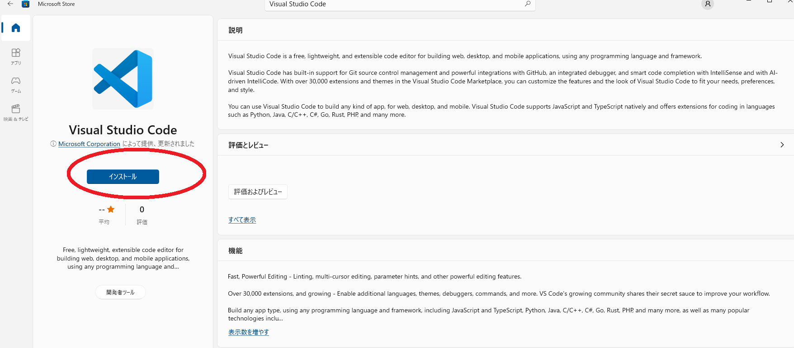

# windowsのpowershellを使ってテトリス環境を構築する

### powershellとは

windowsで利用できる、コマンドラインインターフェース。  
「Windows」＋「S」で検索ボックス"powershell"と入力すると見つかるはず。  
> [Windows10 - PowerShell(パワーシェル)の開き方](https://www.curict.com/item/f0/f0f6ab0.html)  

## 1. git のインストール

### Windows Package Manager(winget)がある場合

[Windows Package Manager(winget)](https://www.microsoft.com/ja-jp/p/app-installer/9nblggh4nns1?activetab=pivot:overviewtab)があることを確認する。  
powershellを起動して以下を実行すれば確認できる。

```
winget --version
## v1.1.13405 等と出力されれば、Windows Package Manager(winget)がある
```

gitをインストールする。

```
winget install Git.Git
## もし y/n と出る場合は、y と入力する。y=yes という意味である。
```

新しくpowershellを起動し、以下を実行して結果が表示されればOK

```
git --version
## ex.) git version 2.34.1.windows.1 等と出力されればOK（最新バージョンであればOK）
```

### 上記でインストールができない場合

上記でインストールができない場合は、公式サイトのインストーラーを使う。以下をダウンロードする。

> [git Downloading Git](https://git-scm.com/download/win)  
> 64-bit Git for Windows Setup  

以下の「Gitのインストール」部分記載の通り、インストールを進める。以下の記載部分は選択が必要。

> Windows 10 と Powershell（WSL含む） で git を利用する  
> https://qiita.com/kerobot/items/78372640127771f92ee0#git-%E3%81%AE%E3%82%A4%E3%83%B3%E3%82%B9%E3%83%88%E3%83%BC%E3%83%AB  
> > コマンドラインやPowerShellなどからGitのコマンドを利用するため「Git from the command line and also from 3rd-party software」を選択します。

powershell上で以下を実行して結果が表示されればOK

```
git --version
## ex.) git version 2.34.1.windows.1 等と出力されればOK（最新バージョンであればOK）
```

## 2. python のインストール

### microsoft storeからインストールする

powershell上で以下を実行、もしくは`microsoft store`上で`python`と検索し、インストールページからインストールする。

```
python
```


新しくpowershellを起動し、以下を実行して結果が表示されればOK

```
python --version
## ex.) Python 3.10.9 等と出力されればOK（最新バージョンであればOK）
```

### 古いバージョンのpythonが表示される場合

過去に古いバージョンのpythonをインストールしている場合にそちらが優先される可能性がある。  
「Windows」＋「python」で検索ボックスから古いpythonバージョンをアンインストールして再度新しいpythonをインストールすると解決することがある。

### 上記でインストールができない場合

上記でインストールができない場合は、公式サイトのインストーラーを使う。  
以下記事を参照し、パッケージのダウンロード～PowerShellの環境設定までを実施する

> [Windows版Pythonのインストール](https://www.python.jp/install/windows/install.html)  

2023.1時点ではpythonのバージョン3.10.9が利用し易そうである。  
この場合は、以下のダウンロードリンクからインストーラ(`.exe`)を取得するとよい。  

> [非公式Pythonダウンロードリンク](https://pythonlinks.python.jp/ja/index.html)  

特に以下の点を忘れずに実施する。

> > "Add Python 3.x to PATH" をチェックするのを忘れないようにしてください。  
> > もし忘れたら、あわてず落ち着いてもう一度インストールしましょう。何度でも繰り返して大丈夫です。  
>
> > PowerShellの環境設定¶  
> > PowerShellでスクリプトの実行を許可しておきます。  
> > スタートメニューで Windows PowerShell | Windows PowerShell を起動し、次のコマンドを実行します。  
> Set-ExecutionPolicy RemoteSigned -Scope CurrentUser -Force  

powershell上で以下を実行して結果が表示されればOK

```
python --version
## ex.) Python 3.10.9 等と出力されればOK（最新バージョンであればOK）
```

## 3. powershellからtetrisを実行する

powershellを新たに起動する  
(「Windows」＋「S」で検索ボックス"powershell"と入力すると見つかるはず。見つかったらクリックして起動する。)  
  
  
バージョンを確認する  
ここでバージョンが何も表示されなければインストールが成功していないため、インストールからやり直す
  
```
git --version
## ex.) git version 2.34.1.windows.1 等と出力されればOK（最新バージョンであればOK）
python --version
## ex.) Python 3.10.9 等と出力されればOK（最新バージョンであればOK）
```

必要なパッケージをインストールする

```
pip install pyqt5
pip install numpy
```

以下の通り実行し、tetrisが表示されればOK

```
cd ~
mkdir work
cd work
git clone https://github.com/seigot/tetris
cd tetris
python start.py  # ここでtetrisが表示されればOK
```

プログラム内部の説明については以下など参照ください

[ブロック操作用サンプルプログラムについて](./block_controller_sample.md)  
[AIについて](./ai.md)  
[tetris artについて](./art.md)  
[README.md](https://github.com/seigot/tetris#%E5%AE%9F%E8%A1%8C%E6%96%B9%E6%B3%95)  

### option. エディタのインストール

最近流行りのエディタである`visual studio code`をインストールしておくと後のコード編集に便利である  
powershell上でwingetが使える場合は以下を実行、  

```
# powershell上でwingetが使える場合
winget install vscode
```

もしくは`microsoft store`上で`visual studio code`と検索し、インストールページからインストールする。



powershell上で以下を実行して`vscode`と対象のコードが表示されればOK

```
# cd ~/work/tetris 等で事前にcloneした場所に移動しておく
code game_manager/block_controller.py
```

### `python start.py`実行後にtetrisが表示されない場合

実行環境の違いにより`python start.py`実行後にtetrisが表示されないことがたまにある。  
この場合はwarningやエラーログが出力されるはずなので、以下の実行成功時のログと比較すると解決に近づくと思われる。

```
# （例）実行成功時のログ
$ python start.py
game_level: 1
game_time: 180
RANDOM_SEED: 0
IS_MODE :default
OBSTACLE_HEIGHT: 0
OBSTACLE_PROBABILITY: 0
USER_NAME: window_sample
SHAPE_LIST_MAX: 6
BLOCK_NUM_MAX: -1
RESULT_LOG_JSON: result.json
TRAIN_YAML: config/default.yaml
PREDICT_WEIGHT: outputs/latest/best_weight.pt
Python 3.7.1
CompletedProcess(args='python --version', returncode=0, stderr='')
=================================================>
...(以降、tetrisデバッグ情報が表示される)
```

## 参考
[git Downloading Git](https://git-scm.com/download/win)  
[Windows 10 と Powershell（WSL含む） で git を利用する](https://qiita.com/kerobot/items/78372640127771f92ee0#git-%E3%81%AE%E3%82%A4%E3%83%B3%E3%82%B9%E3%83%88%E3%83%BC%E3%83%AB)  
[Windows版Pythonのインストール](https://www.python.jp/install/windows/install.html)  
[非公式Pythonダウンロードリンク](https://pythonlinks.python.jp/ja/index.html)  
[WindowsPowerShellでPythonを利用する](https://bluebirdofoz.hatenablog.com/entry/2019/01/19/141007)  
[GNU Emacs for Windows再入門](https://emacs-jp.github.io/tips/emacs-for-windows)  
[visual studio codeをinstall](https://azure.microsoft.com/ja-jp/products/visual-studio-code/)  
[WindowsにBashをインストールする方法](https://lab.sonicmoov.com/development/windows-bash/)  
[Windows Subsystem for Linuxが表示されない](https://qiita.com/taraka/items/0b5919ac8ee02d81f7ff)  
