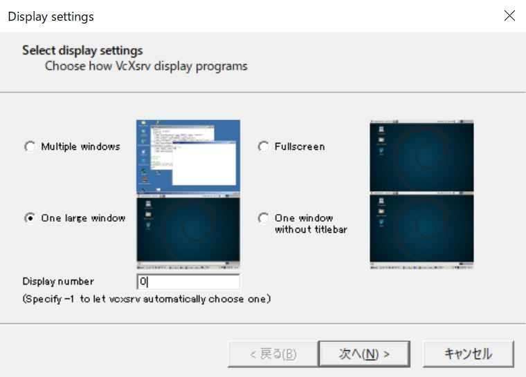
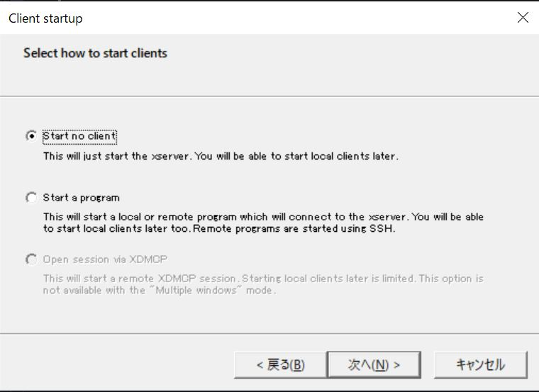
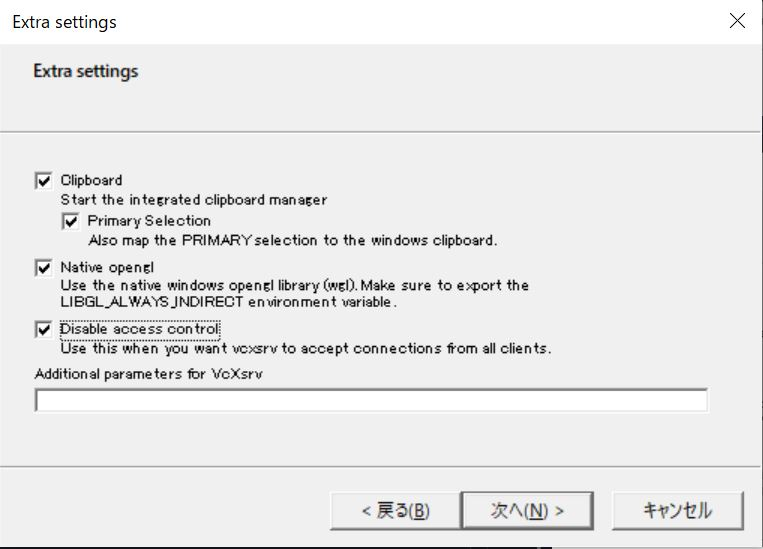

# X サーバの起動方法

docker コンテナ内でテトリスプログラムを実行する場合、GUI を表示させるためにはホスト OS 側で[x サーバ](https://qiita.com/kakkie/items/c6ccce13ce0beaefaad1)を起動する必要があります。

# Windows の場合

windows 環境用の x サーバとして VcXsrv を例に説明します。  
動作検証済み環境 windows10

## VcXsrv をインストールする

[公式サイト](https://sourceforge.net/projects/vcxsrv/)からダウンロード、インストールしてください。設定は全てデフォルトのままで OK です。

## VcXsrv を起動する

インストールが完了後、`XLaunch`を起動する。

## 設定

display setting を`One large window`（お好みでお選びください）、Display Number を`0`に設定し、[次へ]

[次へ]

Disable access control にチェックをつけて、[次へ]

[完了]  
これで真っ黒な画面が一つ立ち上がれば、x サーバの起動完了です。
